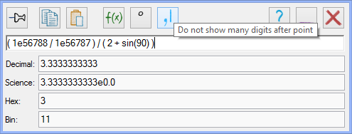

# Overview

High-precision calculator.

Features:

- string expression;
- result output in usual, science, hexadecimal and binary mode;
- support of bitwise operators and trigonometry functions.

# Requirements

.NET Framework 4.5.

# Download

[MiCalc.zip](https://github.com/liiws/MiCalc/releases/download/1.0.3/MiCalc.zip) (0.1 MB).
